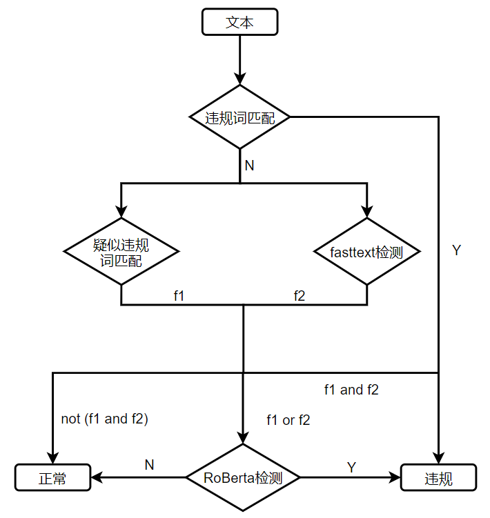

## Illegal text detection

违规文本检测，包含涉政、色情、辱骂文字的文本视为违规文本，本方法适用于短文本。
本方法仅限于判断文本是否包含违规内容，属于文本分类问题。

### 1. System structure

本文提出的违规文本检测方法流程如下图所示。违规词和疑似违规词由人工收集，文本中匹配
到违规词则识别为违规文本，例如“煞笔”。文本匹配到疑似违规词或者fasttext模型判断为
违规文本则进一步由RoBERTa模型判断。



使用疑似违规词匹配和fasttext检测是为了减少RoBerta检测负荷。
### 2. file
1. data：数据文件夹\
   ——train_original.txt:原始训练集\
   ——test_original.txt：原始测试集\
   ——dev_original.txt：原始验证集\
   ——train.txt:数据增强后的训练集\
   ——test.txt：数据增强后的测试集\
   ——dev.txt：数据增强后的验证集
2. dicts：词典文件夹\
      ——illegal.txt：违规词\
      ——illegal_char_split.txt：违规字拆解 \
      ——suspected_illegal.txt：疑似违规词\
      ——trad2simp.txt：繁简转换词典\
3. models: 模型构建代码
4. outputs:模型保存文件夹
5. Pre_trained_model:预训练模型文件夹
6. ac.py：构建AC自动机
7. config.py：配置文件
8. generate_data：数据增强
9. illegal_check.py: 主函数，系统入口
10. preprocess.py: 数据处理
11. train_fasttext.py: 训练fasttext
12. train_roberta.py: 训练roberta

### 3. requirement

1. torch==1.8.1
2. jieba==0.42.1
3. pyahocorasick==1.4.0
4. scikit-learn==0.24.2
5. transformers==4.6.0

### 4. data

```text
__label__1	打 你 马勒 格比仗 死 政府 的 游戏 ！
__label__0	跟 对 人 赢 一世
```

为了防止被系统屏蔽，用户通常会魔改违规用语，常用的魔改方式有：\
1）插入无关字符。例如“强#,,奸”；\
2）拆字。例如”弓虽女干“；\
3）同音替换。例如“卧槽”；\
4）拼音替代。例如“wo cao”。\
模拟上述四种情况完成数据增强。

### 5. roberta download
使用哈工大开源版本，调用方式和BERT相同。下载后放到pre_trained_model\RoBERTa_wwm_ext目录下
[download link](https://github.com/ymcui/Chinese-BERT-wwm)

### 6. train

1. 训练fasttext模型，运行train_fasttext.py文件即可；
2. 训练roberta模型，运行train_roberta.py文件即可。

### 7. inference

1. 调用illegal_check.py中的check()函数，传入待检测文本。

### 8. bascase

1. 英文违规用语无法识别；
2. 字母缩写无法识别；